# Flask y Gunicorn

<p align="left">

</p>

## Índice

1. [Prerrequisitos](#prerrequisitos)
2. [Despliegue](#despliegue)
3. [Tarea de ampliación](#tarea-de-ampliación)

---


## Prerrequisitos

Deberemos tener actualizado el sistema operativo para instalar los paquetes necesarios y pip.

```
sudo apt-get update && sudo apt-get install -y python3-pip
```

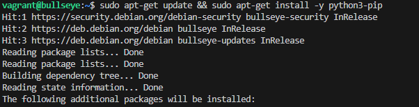

Para instalar pipenv deberemos ejecutar el siguiente comando:

```
pip3 install pipenv
```

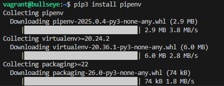

Para comprobar que esta instalado ejecutaremos el siguiente comando:

```
pipenv --version
```

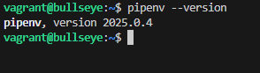

Para instalar python-dotenv deberemos ejecutar el siguiente comando:

```
pip3 install python-dotenv
```

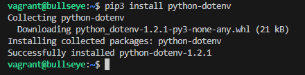


Para alamcenar nuestro proyecto crearemos la siguiente carpeta con el comando:

```
sudo mkdir -p /var/www/app
```

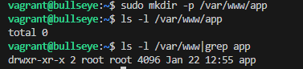

Le establecemos el propietario con el comando:

```
sudo chown -R $USER:www-data /var/www/app
```

Y le damos los permisos necesarios con el comando:

```
sudo chmod -R 775 /var/www/app
```


Creacion de nuevo archivo oculto .env con el comando:

```
sudo nano /var/www/app/.env
```


Haremos nano para hacer la configuracion del archivo .env


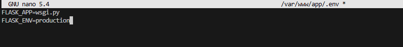

Que sera algo como esto:

```
FLASK_APP=wsgi.py
FLASK_ENV=production
```

Abriremos la consola pipenv con el comando:

```
pipenv shell
```

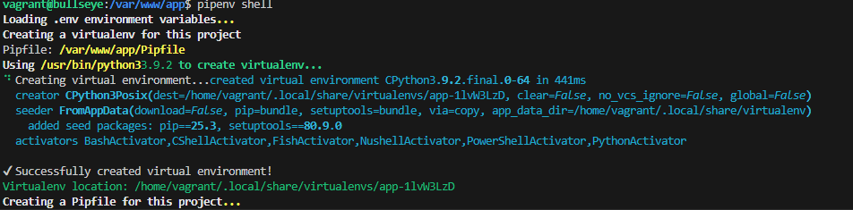

Usamos pipenv install flask gunicorn para instalar las dependencias necesarias:

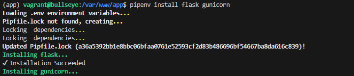

Para crear la aplicacion Flask crearemos el archivo application.py con el comando:

```
touch /var/www/app/application.py
```

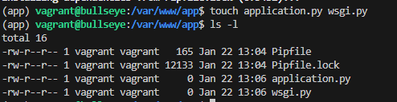

Ahora editaremos el archivo application.py con el comando:
(Esto estando dentro del directorio /var/www/app)

```
sudo nano application.py
```

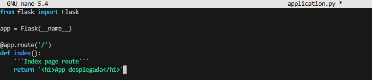

La aplicacion sera algo como esto:

```python
from flask import Flask

app = Flask(__name__)

@app.route('/')
def index():
    return 'Hello, World!'
```


Y el contenido del archivo wsgi.py sera algo como esto:

```python
from application import app

if __name__ == '__main__':
    app.run()
```
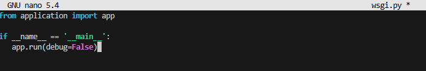

Y para desplegarlo deberemos ejecutar el siguiente comando:

```
pipenv run flask run --host '0.0.0.0'
```

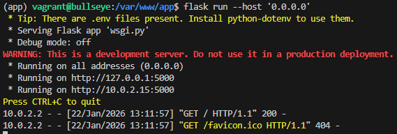

Lo abriremos en el navegador y se verá algo como esto:


Y ahora para desplegarlo con gunicorn deberemos ejecutar el siguiente comando:

```
gunicorn --workers 4 --bind 0.0.0.0:5000 wsgi:app
```

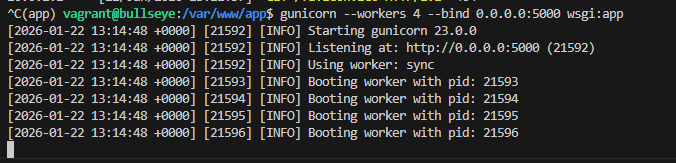

Lo abriremos en el navegador y se verá algo como esto:


Y ahora para poder configurar un servicio del sistema tendremos que obtener la ruta desde la que se ejecuta el gunicorn:

```
which gunicorn
```

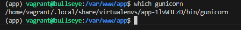

Y ahora iniciaremos nginx con el comando:

```
sudo systemctl start nginx
```

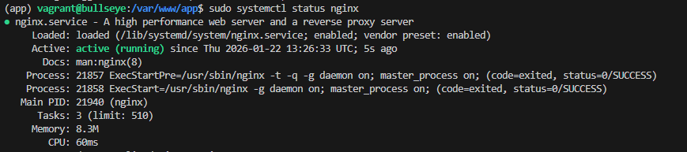

Y ahora para que corra el gunicorn como servicio del sistema crearemos el archivo flask_app.service con el comando:

```
sudo nano /etc/systemd/system/flask_app.service
```

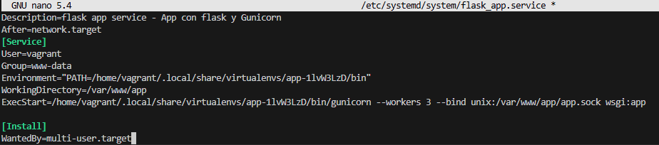


Informaremos de que hay un nuevo servicio con el comando:

```
sudo systemctl daemon-reload
```

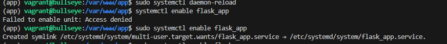

Y ahora lo iniciaremos con el comando:

```
sudo systemctl enable flask_app
```

```
sudo systemctl start flask_app
```

Para hacer la configuracion de nginx haremos el siguiente comando:

```
sudo nano /etc/nginx/sites-available/app.conf
```

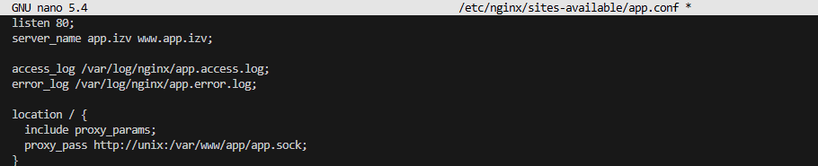

Crearemos un enlace simbolico con el comando:

```
sudo ln -s /etc/nginx/sites-available/app.conf /etc/nginx/sites-enabled/
```

Y ahora lo comprobaremos con el comando:

```
ls -l /etc/nginx/sites-enabled/ | grep app.conf
```

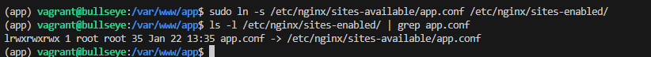

Para comprobar que la configuracion de nginx es correcta ejecutaremos el comando:

```
sudo nginx -t
```

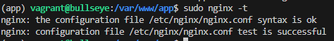

Y ahora rearrancaremos nginx con el comando:

```
sudo systemctl restart nginx
sudo systemctl status nginx
```

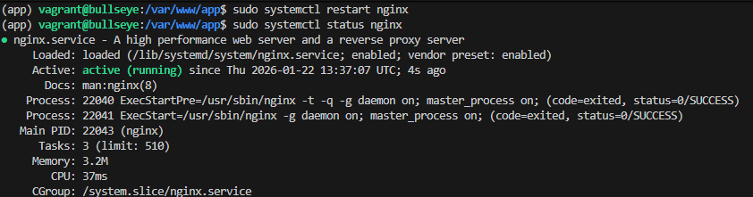

Deberemos poner esta ruta en el archivo hosts en windows para previsualizar la aplicacion:

```
192.168.X.X app.izv www.app.izv
```

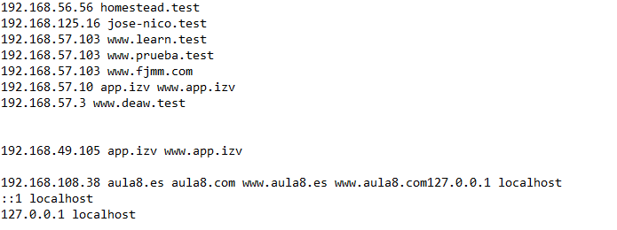


Y se verá en la web así:


